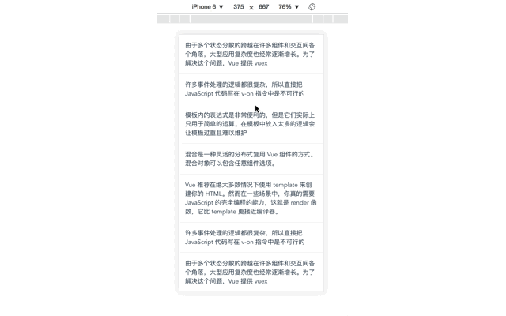
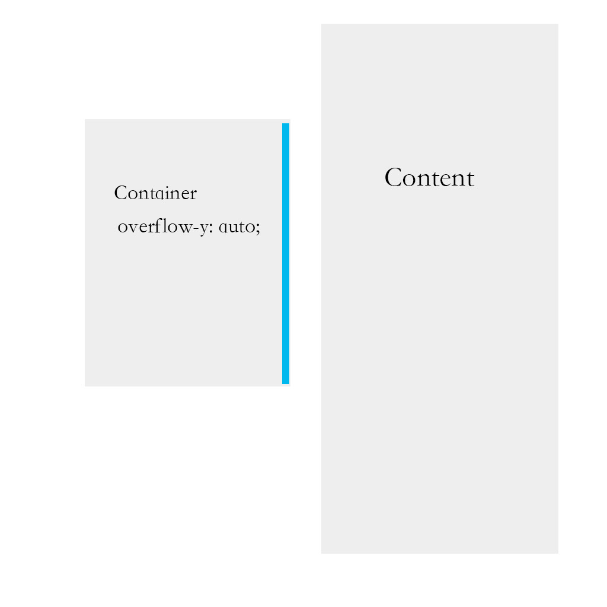

# vue-pullrefresh

> Vue组件实现下拉刷新功能

### 效果图


### Demo地址


### 使用方式
> git clone https://github.com/watson-yan/vue-pullrefresh.git

> 组件的源码路径:  ./src/components/pullRefresh.vue

### 说明
* 组件需要一个prop:next 类型为函数，表示刷新函数, 而且刷新函数需要为Promise语法糖，只有当next被resolve之后。提示信息才会消失
组件代码片段:
```javasccript
this.next().then(() => {
              this.flag = 0
              this.loading = 0
              container.scrollTop = 0
              container.style.overflow = 'auto'
              container.style.transform = 'translate3D(0px, 0px, 0px)'
          })
```

### 设计思路
1. 假定我们有一个容器Container(固定高度，并设置样式overflow-y:auto),容器中的内容为Content(内容高度超出容器的高度)。由于内容高度已经超过容器高度，那么容器Container就会出现滚动条。具体图示如下：



2. 当我们在顶部下拉的时候，希望能更新Content中的内容。即在Container的scrollTop为0的时候，我们在触摸屏幕下拉能触发刷新规则。

3. 顶部信息的显示采取固定在Container的顶部，通过下拉的距离控制顶部信息的显示高度，从而达到下拉时显示提示信息的效果。


